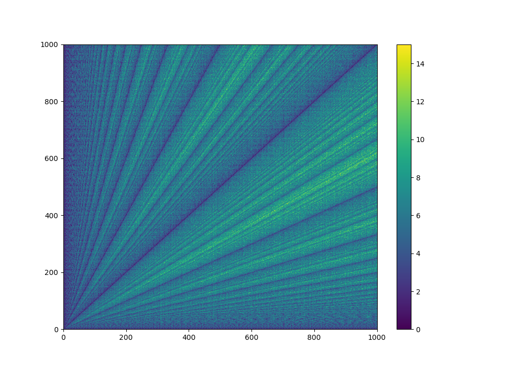

# Euclidean Algorithm

Abstract In this short document we simply go over the proof and more importantly go over the
intuition behind the Euclidean algorithm and the extended Euclidean algorithm. The Euclidean 
algorithm will find the G.C.D. or greatest common divisor of two positive integers. Now the
extended Euclidean algorithm will find the modular inverse of a given integer, modulo some 
base. Thus, this document assumes a comfortableness with topics such as, G.C.D., divisor, 
modular arithimetic, etc.

# 1 Euclidean Algorithm - Finding The G.C.D.

In this section we formally define the G.C.D. function, along with other important concepts,
and given the algorithm for computing its value.

## 1.1 Definitions

* \(a\in\mathbb{Z}\) and \(b\in\mathbb{Z}\) such that \(a,b>0\). These are the two input 
integers which we would like to compute the G.C.D.
* We define the Euclidean divsion to be as follows:
  * Given two positive integers a and b, there exist unique integers \(q\) and \(0\leqq r<b\) 
  such that \(a=qb+r\).
  * \(q\) is the qotient and is considered to be th ouput of the following operator: 
  \(a//b=q\) 
  * \(r\) is the remainder and is considered to be the output of the following operator 
  \(a\%b=r\)
* We define the notation \((a)\) to be the set of integer divisors of a given postive integer 
\(a\). Formaly, \(d\in(a)\) if and only if \(a\%d=0\).
  * This set is finite and has some unique largest value.
  * 1 is always an element of this set.
* We define \(g=\gcd(a,b)\) to be the largest element of the set \((a)\bigcap(b)\).
  * Since 1 is always an element of both sets, this function is always defined.

## 1.2 Important Lemma

Let \((a)\) be the set of integer divisors of a given postive integer a. Let a,b be integers
and let \(r=a\%b\) where \(\%\) is the modulus operator. Thus we can write \(a=nb+r\) for 
some integer \(n\).

**Claim:**  \((a)\bigcap(b)=(b)\bigcap(r)\).

\(\rightarrow\)  **Prove**: \((a)\bigcap(b)\subseteq(b)\bigcap(r)\). Let \(d\in(a)\bigcap(b)\) 
be a divsor of both a and b, then \(a=n_{a}d\) and \(b=n_{b}d\) for some integers \(n_{a}\) 
and \(n_{b}\). So \(r=(n_{a}-n_{b}n)d\) by defintion. Since \(n_{a}-n_{b}n\) is also an 
integer, we can say that \(d\) divides both \(b\) and \(r\). So we can conclude 
\(d\in(b)\bigcap(r)\) thus proving the set inequality.

\(\leftarrow\) **Prove:** \((a)\bigcap(b)\supseteq(b)\bigcap(r)\). If the divisor 
\(d\in(b)\bigcap(r)\), then \(r=n_{r}d\) and \(b=n_{b}d\) for some integers \(n_{r}\) and 
\(n_{b}\). So \(a=(nn_{b}+n_{r})d\) by definition. Since \(nn_{b}+n_{r}\) is also an 
integer, we can say that \(d\) divides both \(a\) and \(b\). So we can conclude 
\(d\in(a)\bigcap(b)\) thus proving the set inequality. Since both set inequalities hold, 
the sets must be equal.

With this result, we can both derive and prove a fairly simple procedure for computing the 
G.C.D. of two integer inputs which we go over in the next section. A direct application of 
the above lemma gives the following relation: \(\gcd(a,b)=\gcd(b,r)\), again where r is the
remainder of the a modulus b. Since the sets equal, the largest element must be the same.

## 1.3 Algorithm 

Consider the following example suppose you want to find the G.C.D. of 97 and 35. Usng the 
above lemma how would you begin? Well we know that \(\gcd(97,35)=\gcd(35,27)\) where 
\(27=97\%35\). Well now we can just apply the same rule so, \(\gcd(35,27)=\gcd(27,8)\) 
where \(8=35\%27\). Now the rest of this computation is tabulated in table 1.

| \(a\) | \(b\) | \(r\) |
| ----- | ----- | ----- |
| 97	| 35	| 27    |
| 35	| 27	| 8     |
| 27	| 8	    | 3     |
| 8	    | 3	    | 2     |
| 3	    | 2	    | 1     |
| 2	    | 1	    | 0     |

As we can see from the table, we reach a point where the remainder is 0. At that point we 
can halt computation as we found a number that actualy divides both inputs, that number is 
what is currently stored in the \(b\) column. This yields a very simple recursive routine. \
We define a one liner, C routine below. As shown in Algorithm 1, it recursively computes \
\(a\%b\), replacing \(a\) with \(b\), and replacing \(b\) with \(r=a\%b\).

```C
int gcd(a,b){ b == 0 ? return a : return gcd(b, a% b); }
```
## 1.4 Computational Complexity

In this section we explore the computational complexity of the G.C.D. algorithm. We assume 
\(a\) and \(b\) are stored in registers and the computation of the modulus is an \(O(1)\) 
operation. Moreover, the moving \(a,b,r\) into the correct registers we again assume is \
\(O(1)\) and thus we assume each iteration of the G.C.D. alorithm is constant time. Thus we\
can fully describe the computational complexity in terms of how many iterations it takes. 
Image 1 is a graphic of how many iterations it take for all pairs of inputs up to 1000. 
This produces an intersting pattern.



To begin, one intersting detail we can observe by using the computational experiment that 
produced the above image is, the maximum number of iterations over all pairs to 1000, is 
15 and this occurs at the input 610,987. The keen observer would notice that these are two 
successive Fibonacci numbers. Moreover the apparent lines created in Image 1 are cases where 
one of the inputs divide each other and correspond to the lines \(y=nx\) and
\(y=\frac{1}{n}x\). Now to quantify and bound the number operations, consider the following
property.

### 1.4.1 Minimal Decrease and The Fibonacci Sequence

Let \(r_{i}\) for \(i=1,...,n\) be the sequence of remainders in the G.C.D. algorithm. The 
sequence is initialized with \(r_{1}=a\) and \(r_{2}=b\). Then the sequence is updated with
the following rules \(r_{i}=r_{i-2}\%r_{i-1}\). It termineated with \(r_{n}=0\), which 
corresponds to a G.C.D. algorithm terminating in \(n-2\) iterations, since \(r_{1}=a\) and 
\(r_{2}=b\) do no not correspond to any computation. Now, we will not formally prove it, 
but the reader can convience oneself that for each element in the sequence, the minimal \
decrease occurs when \(r_{i}=r_{i-2}-r_{i-1}\), in otherwords the quotient \(q=1\) in the 
Euclidean divsion. Thus the sequence will be of maximum length when when at each step the 
minimal decrease occurs. This produces an interesting sequence, the Fibonacci sequence. Let
\(f_{k}=r_{n-k}\). Now \(f_{0}=0\) and \(f_{1}=1\) and using the maximal decrease rule to 
generate the sequence yields \(f_{i}=f_{i-1}+f_{i-2}\) i.e. the Fibonacci Sequence.

### 1.4.2 Bounding the Number of Iterations

Using the above sequence defintion, specifically the Fibonacci Sequence \(f_{k}\), we can 
bound then number of G.C.D iterations, with inputs \(a\) and \(b\) using with the following.
Suppose \(b<f_{k}\) for some minimal upper bound \(f_{k}\). Then the G.C.D. alorithm will 
terminate in at most \(k\) iterations. This is because the worst possible input is when both
inputs are successive Fibonacci numbers because leads to a sequence of remainder such that
decrease in each element in the remainder sequnce is minimal. We can verify this 
computationally. As an example of this experiment, as we showed above the inputs 610,987 
take 15 iterations and 610 is the 15th element in the Fibonacci Sequence as we defined it 
above. 

Now to see how the number of steps grow with input size, we can simply use the fact that 
the Fibonacci Sequence is upper bounded by an exponential with base of the golden ratio 
\(\phi\) . In other words, \(f_{k}\) is \(O(\phi^{k})\) implying for a given \(f_{k},k\) is
\(O(\log_{\phi}f_{k})\). Now this also implies that for a given input the number of 
iterations is \(O(\log_{\phi}b)\) where \(b\) is defined to be the smaller of the two inputs.

# 2 Extended Euclidean Algorithm

## 2.1 Definitions

* Let \(a>0\) be some integer. Now we define the inverse of \(a mod b\) to be the integer 
\(a^{-1}>0\) such that \((aa^{-1})\%b=1\). In other word, the inverse of \(a mod b\) is an 
integer \(a^{-1}>0\) such that their product is 1, when taken with the modulus of \(b.\) 
  * The inverse is not unique because \(a^{-1}+nb\) for all integers \(n\) will also satisfy
  the above definition.
  * Solution only exists if \(a\) and \(b\) are coprime i.e. \(\gcd(a,b)=1\)
* Finding an inverse is equvilent to solving the following. Find non zero integers \(n\) 
and \(m\) such that \(an+bm=1\).
  * \(n=a^{-1} mod b\) and \(m=b^{-1}mod a\).

## 2.2 An Example

The easiest way to introduce this is to consider an example. So let's take the our example 
from above finding the G.C.D. of 97 and 35. But we are now going to track the quotient of 
each Euclidean division and see if we can manipulate that to produce the modular inverse.

| \(a\)  | \(b\)  | \(r\) | \(q\) |
|----|----|----|---|
| 97 | 35 | 27 | 2 |
| 35 | 27 |	8  | 1 |
| 27 | 8  |	3  | 3 |
| 8	 | 3  |	2  | 2 |
| 3  | 2  |	1  | 1 |

Looking at table 2, we simply did the same steps as in table 1 but we omit the last row of 
the table. Looking at the last row we can see that we can write the following equavalence 
\(1=1*3-1*2\) . So we can write 1 in terms of 3 and 2, a and b on the last iteration. But 
we can write 2 in terms of \(a\) and \(b\) on the second to last iteration, 8 and 3. And we
can continue this until we have 1 on the left and side and the original \(a\) and \(b\) on 
the right hand side. This gives us our modular inverses.

To what inverses end up being we introduce 2 new registers \(n_{a}\) and \(n_{b}\). As with
\(a\) and \(b\), their values change on each iteration. However, we are going to compute 
\(n_{a}\) and \(n_{b}\) in reverse order, starting with the last row, moving to the first 
row. So on the last row we have \(1=n_{a}*3+n_{b}*2\) where \(n_{a}=1\) and \(n_{b}=-1\). 
Now on the second iteration we have \(1=1*3-1*(8-2*3)=-1*8+3*3\). So \(n_{a}=-1\) and 
\(n_{b}=3\). If we apply this iteratively we get the following update rules, 
\(n_{a}\leftarrow\overline{n_{b}}\) and \(n_{b}\leftarrow\overline{n_{a}}-\overline{n_{b}}q\).
We use the notation that the bar indicates the value on the previous iteration and the 
quotient \(q\) is simply the value of \(q\) on the current iteration. On the first iteration
, the last row, we initialize \(n_{a}=1\) and \(n_{b}=-q\). We can use these update rules 
to fill out the table with \(n_{a}\) and \(n_{b}\). This is shown in table 3. Which gives 
us the solution of \(a^{-1}=13\) and \(b^{-1}=-36\) mod the other. This can of course be 
verified by simply taking the product followed by computing the modulus.

| \(a\) | \(b\) | \(r\) | \(q\) | \(n_a\) | \(n_b\) |
| ----- | ----- | ----- | ----- | ------- | ------- |
| 97    |	35  |	27	| 2	    |   13    |	-36     |
| 35	|   27  |	8	| 1	    |   -10	  | 13      |
| 27	|   8   |	3	| 3	    |   3	  | -10     |
| 8	    |   3	|   2	| 2	    |   -1	  | 3       |
| 3	    |  2    |	1	| 1 	|   1	  | -1      |

## 2.3 The Algorithm

Unlike the G.C.D. algorithm we use an iterative approach here. We first compute all the 
quotients and then use those quotients to iteratively compute the inverses from the bottom 
row up. More effient algorithms exist, however, this implementation is as close to how one 
would do it by hand and thus we use this implementation. It has the same computational 
complexity as the G.C.D. algorithm, only with on extra linear sweap. This algorithm is 
implemented in python in image 2.


