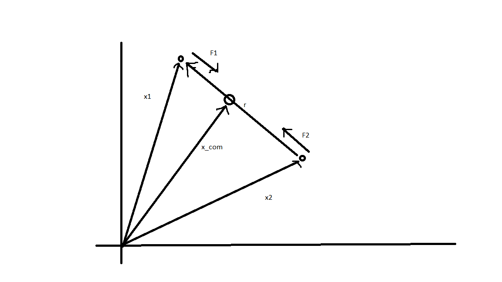
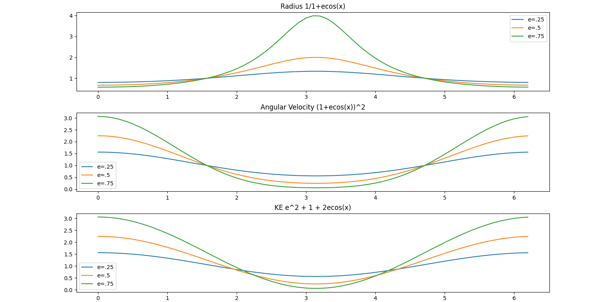
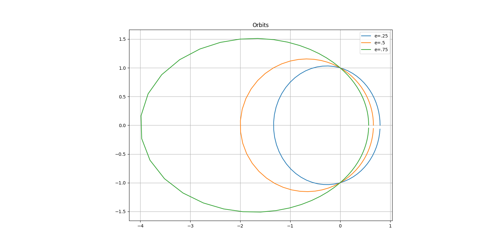
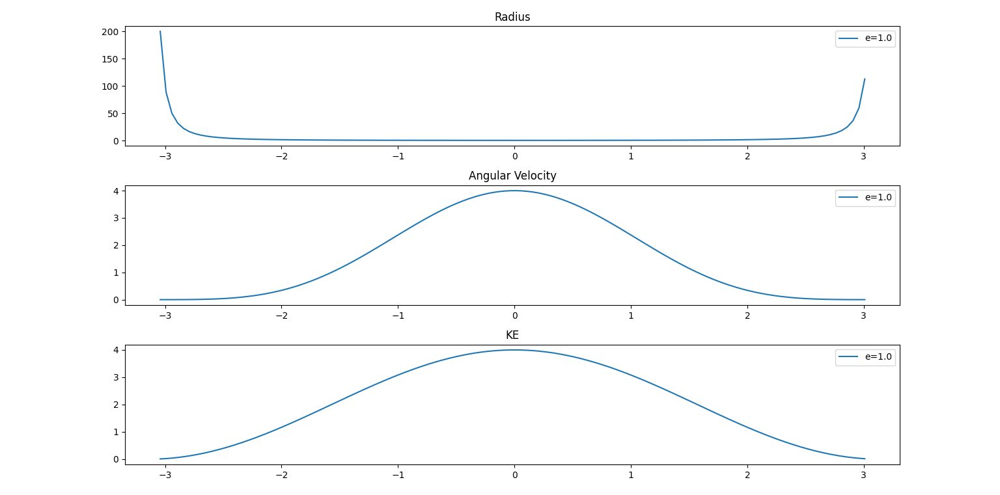
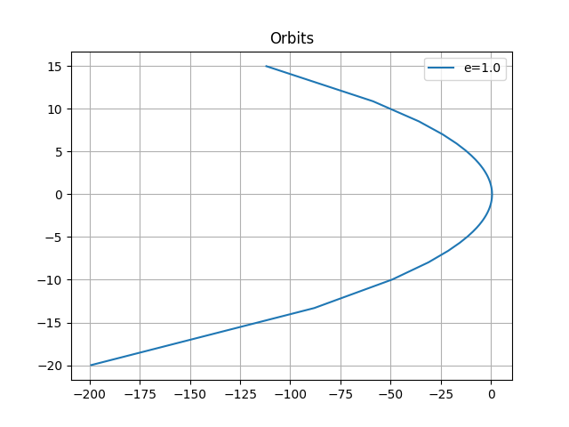

# Two Body Problem

## Motivation

Simply consider two objects floating in space with respective masses and known intial 
positions and velocities. These two bodies follow Newtons Law of graviatation. These will 
be our only assumptions (along with conservation of energy). Specifically we start by 
defining the force between two point paritcles in 3+1 flat euclian space with positions, 
velocities, and masses \(x_{1}(t), x_{2}(t), \dot{x}_{1}(t), \dot{x}_{2}(t),M_{1},M_{2}\).
Each particle exerts an equal and opposite force on each other along the vector \(r(t)\)
i.e. the line connecting the two particles. The force \(F_{1}\) denotes the force of 
particle 2 on 1, and vice versa for \(F_{1}\) acts in the direction \(r(t)\) which we 
define as the vector pointing from \(x_{2}(t)\) to \(x_{1}(t)\) (note we also define
\(\hat{r}\) to denote the unit vector where as r encodes the distant between the two 
particles as well as the direction). Formally,

$$ \begin{cases} 
        F_{1}=-G\frac{M_{1}M_{2}}{\Vert r(t)\Vert^{2}}\hat{r} & 
        F_{2}=G\frac{M_{1}M_{2}}{\Vert r(t)\Vert^{2}}\hat{r}
    \end{cases}
    \hspace{2cm} (1)
$$

$$
    \begin{cases}
        r(t)=x_{1}(t)-x_{2}(t) & \hat{r}=
            \frac{x_{1}(t)-x_{2}(t)}{\Vert x_{1}(t)-x_{2}(t)\Vert}
    \end{cases}
    \hspace{2cm} (2)
$$

Applying netwons second law \(F=m\ddot{x}\) to this yields the following highly non linear 
ODE:

$$
    \begin{cases}
        \ddot{x}_{1}=-G\frac{M_{2}}{\Vert r(t)\Vert^{2}}\hat{r} & 
        \ddot{x}_{2}=G\frac{M_{1}}{\Vert r(t)\Vert^{2}}\hat{r}
    \end{cases}
    \hspace{2cm} (3)
$$

To help visualize and foreshadow:



## Center of Mass, Reduction to 1-D Problem, and Linear Momentum Conserved

(3) Is very compact and intuitive but is highly non linear and does immediatly suggest a 
solution. So we know the center of mass is an important point in gravitation problems so 
lets see the dynamics of the center of mass \(x_{com}(t)\). By definition 
\( x_{com}(t)=\frac{1}{M_{1}+M_{2}}(M_{1}x_{1}(t)+M_{2}x_{2}(t)) \). Now simply differentiate
twice with respect to time: \(\ddot{x}_{com}(t)=\frac{\Vert r(t)\Vert^{2}}{M_{1}+M_{2}}
(F_{1}+F_{2})=0\) since \(F_{1}=-F_{2}\).

Thus we can see that \(x_{com}(t)\) is non accelerating and thus is an interial frame and so we
will continue our analysis in this frame. As a quick detour, this allows us to show that 
momentum is conserved. To see this, consider that \(\dot{x}_{com}(t)\) is constant by the 
above reasoning. Thus \(\dot{x}_{com}(t)=\frac{1}{M_{1}+M_{2}}(p_{1}(t)+p_{2}(t))\) is 
constant implying the total momentum is constant. Now continuing, we can rewrite \(x_{2}(t)\)
and \(x_{1}(t)\) in terms of the center of mass. Foreshadowing, lets define 
\(\mu=\frac{M_{1}M_{2}}{M_{1}+M_{2}} \)

$$
x_{com}(t)=\frac{\mu}{M_{2}}x_{1}(t)+\frac{\mu}{M_{1}}x_{2}(t)
$$

$$
x_{1}(t)=\frac{\mu}{M_{2}}x_{1}(t)+\frac{\mu}{M_{1}}x_{2}(t)-\frac{\mu}{M_{1}}x_{2}(t)-
(\frac{\mu}{M_{2}}-1)x_{1}(t)
$$

$$
x_{1}(t)=x_{com}(t)-(\frac{\mu}{M_{1}}x_{2}(t)+\frac{-M_{2}}{M_{1}+M_{2}}x_{1}(t))
$$

Finally we get the following, where the posistion of particle 2 comes from symmetry:

$$
\begin{cases}
    x_{1}(t)=x_{com}(t)+\frac{\mu}{M_{1}}r(t) & x_{2}(t)=x_{com}(t)-\frac{\mu}{M_{2}}r(t)
\end{cases}
\hspace{2cm} (4)
$$

Selecting the center of mass as our interial frame shows \(x_{2}(t)\) and \(x_{1}(t)\) only
depend on the vector defining their displacement \(r(t)\). So what are the dynamics of 
\(r(t)\)? Well first

$$
\ddot{r}(t)=\ddot{x}_{1}(t)-\ddot{x}_{2}(t)
$$

Aplying (3)

$$
\ddot{r}=-G\frac{M_{2}}{\Vert r(t)\Vert^{2}}-G\frac{M_{1}}{\Vert 
r(t)\Vert^{2}}\hat{r}=-(M_{1}+M_{2})\frac{G}{\Vert r(t)\Vert^{2}}\hat{r}
$$

A little maniputlation:

$$
\frac{M_{1}M_{2}}{M_{1}+M_{2}}\ddot{r}=F_{1}=-G\frac{M_{1}M_{2}}{\Vert r(t)\Vert^{2}}\hat{r}
$$

Cleaning up

$$
\mu\ddot{r}=F_{1}
$$

So we see that our two particle system can be broken into a simpler one body problem, 
whose position is defined by r(t), with mass \(\mu=\frac{M_{1}M_{2}}{M_{1}+M_{2}}\), 
subject to a net force \(F_{1}\). Note that \(F_{1}\) points in the opposite direction of 
\(r(t)\), implying the force is trying to pull the bodies together as expected, but the pull
weakens as \(r(t)\) increases.

## Angular Momentum is Conserved and Reduction to 2+1 Space

Lets looks at the angular momentum of this 1 particle system. 
\(L=r\times p=r\times\mu\dot{r}\). Now simply take the time derivative this expression. 
\(\dot{L}=(\dot{r}\times\mu\dot{r})+(r\times\mu\ddot{r})\). Now the first term is 0, because
the cross product of a vector and its scalar multiple is zero. Now the second term is just 
\(r\times\mu\ddot{r}=r\times F_{1}\). These two vectors are anti parallel by defintion and 
this is 0. This implies the rate at which angular momentum is changing is zero. This implies
angular momentum is constant. So we let \(L\) be the intial and only angular momentum of 
this system.

With angular momentum being conserved, we can find an interial frame where are 1 particle 
system rotates in a 2D plane. So from here on out we will assume that we are in that we are
in that interial frame and will assume the third component of our 3D system is 0. So, 
\(r(t)=r_{x}(t)\hat{i}+r_{y}(t)\hat{j}\) in the 2D cartesian coordinate plane.

## Energy and Polar Coordinates

Now let us look at the energy of this, 2D 1 body problem. The total energy is given by 
\(E=K+U\). Where \(K=\frac{1}{2}\mu\Vert\dot{r}\Vert^{2}\) and 
\(U=-G\frac{M_{1}M_{2}}{\Vert r(t)\Vert}\). So before continuing let us define polar 
cordinates. \((r_{y}(t)=R(t)\sin(\theta(t))\) and \(r_{x}=R(t)\cos(\theta(t))\). This is 
motivated by the fact that our problem now exists in the catesian plane, and we know that 
these equations describe graviataion and thus usually exhibit an orbitting behavior. So 
\(U(R)=-G\frac{M_{1}M_{2}}{R}\). Now finding the kinetic energy is a bit more complicated, 
but we have the following transformation

$$
\dot{r}_{x}=\dot{R}\cos(\theta)-R\sin(\theta)\dot{\theta}
$$

$$
\dot{r}_{y}=\dot{R}\sin(\theta)+R\cos(\theta)\dot{\theta}
$$

So we already have our potential energy in terms of our new polar coordinate variables, 
\((R,\theta)\). Now let us find an expression in these coordinates for our kinetic energy. 
We know \(K=\frac{1}{2}\mu(\dot{r}_{x}^{2}+\dot{r}_{y}^{2})\). We can plug our 
transformation from above into this expression and one gets:

$$
K=\frac{1}{2}\mu(\dot{R}^{2}+R^{2}\dot{\theta}^{2})
$$

However we can simplify this further. Since we know that angular momentum is constant, we 
can rewrite the angular velocity term above using this constant. We know \(L=I\dot{\theta}\)
where \(I=\mu R^{2}\) is the moment of inertia. Solving this for the angular velocity leads\
to \(w=\dot{\theta}=\frac{L}{\mu R^{2}}\). Pluging this into kinetic energy gives: 
\(K=\frac{1}{2}\mu\dot{R}^{2}+\frac{L^{2}}{2\mu R^{2}}\). So we get an expression for the 
total energy of this system \(E=K+U\).

$$
E=\frac{1}{2}\mu\dot{R}^{2}+\frac{L^{2}}{2\mu R^{2}}-G\frac{M_{1}M_{2}}{R}
\hspace{2cm} (5)
$$

In the next section we show how to solve this using conservation of energy.

## Solution

To solve (5) we must assume that energy is conserved and thus total energy E is constant. 
It would nice to derive this from the defintion of the forces acting our system, and it 
possibly falls out from the fact that the force is conservative, but its simply easier to 
assume its conserved and move on. So we take the time derivative of (5) and get the 
following differential equations (we also include the dynamics of the angular velocity as 
the below will now fully describe the time depedant dynamics of our system):

$$
\begin{cases}
    \frac{dE}{dt}=\mu\ddot{R}-\frac{L^{2}}{\mu R^{3}}+G\frac{M_{1}M_{2}}{R^{2}}=0 & 
    w=\dot{\theta}=\frac{l}{\mu R^{2}}
\end{cases}
\hspace{2cm} (6)
$$

This is a system of non-linear second order differential equationa and thus we will need to
play with it a bit to solve it. The above is a time depedant equation, i.e. \(R=R(t)\). We \
can simplyify the above by using the angular velocity to find a single time indepandt 
differential equation. So, we can do a change of variables as follows:

$$
\frac{d\theta}{dt}=\frac{L}{\mu R^{2}}
$$

$$
\frac{dR}{dt}=\frac{dR}{d\theta}\frac{d\theta}{dt}=\frac{dR}{d\theta}\frac{L}{\mu R^{2}}
$$

$$
\frac{d^{2}R}{dt^{2}}=(\frac{d}{dt}\frac{dR}{d\theta})\frac{d\theta}{dt}+\frac{dR}{d\theta}(\frac{d^{2}\theta}{dt^{2}})=(\frac{d^{2}R}{d\theta^{2}})(\frac{L}{\mu R^{2}})^{2}+(\frac{dR}{d\theta})^{2}\frac{-2L}{\mu R^{3}}\frac{L}{\mu R^{2}}
$$

Now we can subsitute in the above into (6) giving us a time indepedant differential equation describing our system

$$
\frac{d^{2}R}{d\theta^{2}}\frac{1}{R^{2}}-(\frac{dR}{d\theta})^{2}\frac{2}{R^{3}}-\frac{1}{R}+\mu\frac{GM_{1}M_{2}}{L^{2}}=0
\hspace{2cm} (7)
$$

Now lets try the subsitution \(R=\frac{1}{u}\) and \(\frac{dR}{d\theta}=-\frac{1}{u^{2}}
\frac{du}{d\theta}\) and \(\frac{d^{2}R}{d\theta^{2}}=\frac{2}{u^{3}}\frac{du}{d\theta}-
\frac{1}{u^{2}}\frac{d^{2}u}{d\theta^{2}}\). Plugging this subsittion into our time 
indepedant equation gives:

$$
\frac{d^{2}u}{d\theta^{2}}=\mu\frac{GM_{1}M_{2}}{L^{2}}-u
$$

We can easily solve this. To make that apparent we let \(v=u-\mu\frac{GM_{1}M_{2}}{L^{2}}\).
Which gives

$$
\frac{d^{2}v}{d\theta^{2}}=-v
$$

This has solutions \(v=c_{1}\sin(\theta)+c_{2}\cos(\theta)\). So \(u=\frac{1}{R}=c_{1}
\sin(\theta)+c_{2}\cos(\theta)+\mu\frac{GM_{1}M_{2}}{L^{2}}\). Now we can choose our 
coordinates so that the sin term goes away. This yields the following explicit soltion

$$
R=\frac{L^{2}}{\mu GM_{1}M_{2}}\frac{1}{1+e\cos(\theta)}
\hspace{2cm}
$$

Keep in mind we still have have the following relation \(w=\dot{\theta}=\frac{L}{\mu R^{2}}\)
which allows us to convert from the angular domain to the time domain. But as we can see 
from (8) the general geometry of the solution is that off conic sections. Thus the possible
set of solutions is a cirlce, ellipse, parabola, or hyberbola (and possibly others). For a 
given set of initial conditions, determining which set the dynamics fall into is simply a 
matter of finding the constant e in (8). Now we can plug the radius above into the formulas
for Kinetic Energy, Total energy, and angular velocity so that we have a set of equations 
that sufficently describe the dynamics of our two body and reduced 1 body system. These are:

**Radial**
$$
R=\frac{L^{2}}{\mu GM_{1}M_{2}}\frac{1}{1+e\cos(\theta)}
$$

**Energy**
$$
K=\frac{1}{2}\mu\dot{R}^{2}+\frac{L^{2}}{2\mu R^{2}}=\frac{\mu G^{2}M_{1}^{2}M_{2}^{2}}{2L^{2}}(e^{2}+1+2e\cos(\theta))
$$

$$
E=K+U=\frac{\mu G^{2}M_{1}^{2}M_{2}^{2}}{L^{2}}(\frac{e^{2}-1}{2})
$$

**Angular**
$$
w=\frac{L}{\mu R^{2}}=\frac{\mu G^{2}M_{1}^{2}M_{2}^{2}}{L^{3}}(1+e\cos(\theta))^{2}
$$

**Time**
$$
t(\theta)=\frac{L^{3}}{\mu G^{2}M_{1}^{2}M_{2}^{2}}\intop_{0}^{\theta}\frac{ds}{(1+e\cos(s))^{2}}
$$

The above fully describe the dynamics of our system. For a given angle we can describe the 
radius, angular velocity, and kinetic energy. If one is interested in answering questions 
such as how long it takes to do X or at what point will X happen, then one can use numeric 
integration to calculate how long it takes to sweep a certain angle and use the other 
formulas to compute the desired quantity. The total energy, and thus the eccentricity of the
orbit is determined by the initial conditions. As well as the angular momentum.

## Characterization of Solutions

In this section we further analyze the dyamics of the solution found in the previous 
section. We use the energy, the geometric shape of the orbit, and other parameters to 
investigate the physical reality of the initial two body problem.

### Calculating Eccentricity

Just use the above relation for total energy.

$$
e=\sqrt{1+\frac{2EL^{2}}{\mu G^{2}M_{1}^{2}M_{2}^{2}}}
$$

The above has a “phase” transistion at the following values, inspired by the fact that this
value describes the eccentricity of our orbit:

* If \(E=-\frac{\mu G^{2}M_{1}^{2}M_{2}^{2}}{2L^{2}}\) , then \(e=0\). So circle.
* If \(E>-\frac{\mu G^{2}M_{1}^{2}M_{2}^{2}}{2L^{2}}\) , but \(E<0\) , then \(0<e<1\). So ellipse.
* If \(E>0\), then e>1. So hyperbola.
* If \(E<-\frac{\mu G^{2}M_{1}^{2}M_{2}^{2}}{2L^{2}}\) , then e is imagnary?? Predict this is the case where one body falls into the other.

### Breaking it down by case

We found our solution for the reduced 1-body problem and observe there are several cases 
based on the initial conditions. Thus we break down these cases and charactize the 
resulting solution in each case. Our initial conditions allow us to use the masses, 
relative initial positions i.e. r(0), and relative intial velocites. From these we can 
compute the conserved quantites such as total energy and angular momentum, which we 
tabulate below as a reminder of what can be taken as given.

| Initial Conditions | Value (2-body) | Value (Reduced 1-body) |
| --- | --- | --- |
| Mass | \(M_{1},M_{2}\) | \(\mu=\frac{M_{1}M_{2}}{M_{1}+M_{2}}\) |
| Position | \(x_{1}(0), x_{2}(0)\) |	\(r(0)=x_{1}(0)-x_{2}(0)\) |
| Angular Momentum | \(\mu (r(0)\times v_{1}(0)-v_{2}(0))\) | \(L=r(0)\times\mu(v_{1}(0)-v_{2}(0))\) |
| Total Energy | \(\frac{1}{2}M_{1}v_{1}^{2}(0)+\frac{1}{2}M_{2}v_{2}^{2}(0)-\frac{GM_{1}M_{2}}{\Vert x_{1}(0)-x_{2}(0)\Vert}\) | \(\frac{1}{2}\mu\Vert v_{1}(0)-v_{2}(0)\Vert^{2}-\frac{GM_{1}M_{2}}{r(0)}\) |

In the analysis that follows we consider only the 1 - body problem and treat the solutions 
as describing a single body subject to an external force which yields closed orbits in some
cases and the single particle just flying off to infinity in others. 

#### Circle

| Paramters (Reduced 1-Body) |	Solution |
|---|---|
| Eccentricity | \(e=0\) |
| Radius | \(R=\frac{L^{2}}{\mu GM_{1}M_{2}}\) |
| Angular Velocity | \(w=\dot{\theta}=\frac{\mu G^{2}M_{1}^{2}M_{2}^{2}}{L^{3}}\) |
| Angular Position | \(\theta=\dot{\theta}t\) |
| Angular Domain |	\(\theta\epsilon\mathbb{R}\) |
| Period of Orbit |	\(T=\frac{2\pi L^{3}}{\mu G^{2}M_{1}^{2}M_{2}^{2}}\) |
| Kinetic Energy |	\(K=\frac{1}{2}\mu\frac{G^{2}M_{1}^{2}M_{2}^{2}}{L^{2}}\) |
| Potential Energy | \(U=-\frac{GM_{1}M_{2}}{R}=-\frac{\mu G^{2}M_{1}^{2}M_{2}^{2}}{L^{2}}=-2K\) |
| Total Energy |	\(E=K+U=-K\) |

The case of the circle is very easy to analyze as it is just uniform circle motion. The key
take away here is that the defining dynamics are such that potential energy and kinetic 
energy do no depend on time and thus do not trade off. This implies the defining inital 
conditions that lead to the case of a circular orbit are those such that the overall 
kinetic energy of the motion of the particle is exactly half the magnitude of the 
gravitational potential energy. The particle will then orbit the origin with constant 
radius, contant angular velocity, and constant kinetic energy i.e. uniform circular motion.
Thus, as shown in the above table, we can simplify the general formulas into time and angle
indepedant ones. Moreover, we can compute the period of this orbit rather simply, and its 
value is again shown above. Finally we note that the values the angle can take on are not 
limited and can be any real number.

#### Ellipse

The ellipse's dynamics are more complicated than that of the circle, obviously. More 
specifically, the dynamic of the radius, angular velocity, energy, etc. now vary according 
to the general formulas given in the previous section. However, we can characterize the 
intial conditions that lead to this orbit. Moreover, given the geometry of the orbit, we 
know there are points at which the paramters (i.e. radius) are at extremes and we can 
calcualate these extremal values as well as where they occur in the orbit. Below we plot 
the general form of the radius, angular velocity, and kinetic energy as a function of the 
angular position. Note that we do not scale the graphs in accordance to some choosen 
initial conditions, it is simply the form of the general solutions given in the previous 
section with a few choosen eccentricity parameters less than 1. We also plot the 
elliptical orbit associated with each radius / velocity / energy curve shown.





So the orbit, radius, angular velocity, and energy are fairly well described by the general
formulas and the above graphs. We can see that at \(\theta=0\), the radius is at its mininum 
and its kinetic energy is at its max. This flips at \(\theta=\pi\) . So in the reduced 1-body 
system, when the object to closest to the orgin its moving fast. It gets kicked away from 
the orgin, slowing down. It then accelerates towards back towards the orgin until it 
reaches its closest point, maximum kinetic energy, and the cycle repeats. We can see this 
orbit is, obviously an ellipse, is stable and closed. Thus our angle can take on value. 
Finally, this orbit is predicted by having energy greater than that of the circular orbit, 
but less than 0.

| Parameters (Reduced 1-Body) | Solution |
| --- | --- |
|  Eccentricity	| \(0<e<1\) |
| Radius |	\(R_{max}=\frac{L^{2}}{\mu GM_{1}M_{2}}\frac{1}{1-e} ,R_{min}=\frac{L^{2}}{\mu GM_{1}M_{2}}\frac{1}{1+e}\) |
| Angular Velocity | \(w_{min}=\frac{\mu G^{2}M_{1}^{2}M_{2}^{2}}{L^{3}}(1-e)^{2} , w_{max}=\frac{\mu G^{2}M_{1}^{2}M_{2}^{2}}{L^{3}}(1+e)^{2}\) |
| Angular Domain |	\( \theta\epsilon\mathbb{R} \) |
| Kinetic Energy |	\( K_{min}=\frac{\mu G^{2}M_{1}^{2}M_{2}^{2}}{2L^{2}}(1-e)^{2},K_{max}=\frac{\mu G^{2}M_{1}^{2}M_{2}^{2}}{2L^{2}}(1+e)^{2} \) |
| Total Energy |	\( E<0, such that E\rightarrow0 as e\rightarrow1 \) |

#### Non Capturing Orbits (Parabola/Hyperbola)

Predicted by positive total energy.
**Orbit:** Now the orbit in this case is a hyperbola or parabola. Thus we can expect that the mass 
starts and some position and as time progresses, R\rightarrow\infty . This orbit is not periodic and 
thus it does not make sense to talk about a period. None the less, we can still talk about the 
minimum radius and mininum kinetic energy. We can also talk about the angular velocity and position 
and their extrema, and we can also limit the values of the angular position that makes sense, since 
its not periodic it doesn't make sense to allow our angle to take any value. And we can talk about 
what happens as the radius goes to infinity and the resulting dynamics. Thus this orbit is described 
by a point closest to the body followed by the object drifting away to infinity.

**Radius:** From the general formula, in the hyperbolic case, we see two interesting points. The 
first is the mininum radius at \(\theta=0\) where \(R_{min}=\frac{L^{2}}{\mu GM_{1}M_{2}}\frac{1}{1+e}.
The next is the point where \(R\rightarrow\infty\)  which happens as \(\theta\rightarrow\arccos(-1/e)\).
Due to even symetry of the cosine function, \(R\rightarrow-\infty\)  which happens as 
\(\theta\rightarrow-\arccos(-1/e)\). As an exmple if \(e=1\), then \(R\rightarrow\infty\)  as 
\(\theta\rightarrow\pi\) . But if \(e=2\), then \(R\rightarrow\infty\)  as \(\theta\rightarrow2\pi/3\).

**Angular:** So from the above, we can conclude that we must limit our angualar positions to the 
interval \((-\arccos(-1/e),\arccos(-1/e))\). We can also say the following. The angular velocity is 
maxed at \(\theta=0\) with \(w_{max}=\frac{\mu G^{2}M_{1}^{2}M_{2}^{2}}{L^{3}}(1+e)^{2}\). And as 
\(\theta\rightarrow\pm\arccos(-1/e)\), then angular velocity is minimized, with \(w\rightarrow0\). 

**Energy:** The energy is perhaps the easiest to analyze. As the \(R\rightarrow\infty\) , 
\(U\rightarrow0\), and thus we can say that kinetic energy is minned as \(R\rightarrow\infty\)  with 
the limiting energy simply being the total conserved energy, \(K\rightarrow E=(e^{2}-1)\frac{\mu 
G^{2}M_{1}^{2}M_{2}^{2}}{2L^{2}}\). Likewise, the kinetic energy is maxed at the minimum radius or 0 
angle and this max kinetic energy is \(K_{max}=\frac{\mu G^{2}M_{1}^{2}M_{2}^{2}}{2L^{2}}(1+e)^{2}\).




    
| Parameters (Reduded 1-Body) | Solution |
| --- | --- |
| Eccentricity |	e>1
| Radius |	\(R_{max}=\infty  ,R_{min}=\frac{L^{2}}{\mu GM_{1}M_{2}}\frac{1}{1+e}\) |
| Angular Velocity |	\(w_{min}=0 \) , \(w_{max}=\frac{\mu G^{2}M_{1}^{2}M_{2}^{2}}{L^{3}}(1+e)^{2} \) |
| Angular Domain |	\(\theta\epsilon(-\arctan(-1/e),\arctan(-1/e)) \) |
| Kinetic Energy |	\(K_{min}=E,K_{max}=\frac{\mu G^{2}M_{1}^{2}M_{2}^{2}}{2L^{2}}(1+e)^{2}\) |
| Total Energy |	\(E=(e^{2}-1)\frac{\mu G^{2}M_{1}^{2}M_{2}^{2}}{2L^{2}}\) |

#### Falling Orbits

Predicted by energy less than that of the circle. Hypothesis is that this is a degenerate case that 
only happens if \(L=0\). Equivalently, this would only happen if the initial velocities both lie on 
the line connecting the two bodies. This can be reasoned using conservation of angular momentum. If 
it has angualar momentum, it must keep it. Thus the two bodies can never lie on path that intersects 
(given their point particles). Could try to prove this further, but that reasoning feels right. 

## Application and Verification

Have two body numerical simulation, code below. Given initial conditions it
simulates Newton's laws of gravitation and saves off the data. It then plots an animation showing 
the path of the two bodies through space and prints the conserved quantities to verify their 
conserved. The following can be verified using this simulator:

* Total energy and angular momentum are conserved
* Classification of orbit based on total energy
* Period of elliptical orbits
* Formulas for total energy, min/max kinetic energy, eccentricity, min/max radius, and min/max angular 
  velocity hold
  * Note the prediction of eccentricity works in the elliptical case works, but for the hyperbolic case 
    it does not give correct value. Will not investigate as I calculated eccentricity in a wonky manner
  * All other values are accurately predicted though

## What's Next

* Langranian Mechanics. How we solved this problem is a classic example of how and why the Langrange 
  formulation of classic mechanics is used. Thus a further investigation of this topic is warranted.
*  3 Body Problem. We solved the general 2-body case. What about 3? Its not analytically solvable, but 
  tricks exist.
*  N-body problem. What about for N-bodies?
*  Langrange Points. Stable 3-body configurations.
*  Linear Algebra / Matrix formulation of system of diff eq.
*  Newton's shell theorem
*  LRL vector?
*  Eccentricty vector

## Python Code

### Ellipse Plots

```python
import matplotlib.pyplot as plt
import numpy as np

e = 0.25

def r(x):
    return 1/(1+e*np.cos(x))

def w(x):
    return (1+e*np.cos(x))*(1+e*np.cos(x))

def K(x):
    return e*e + 1 + 2*e*np.cos(x)

x1 = list(np.arange(0, 2*np.pi, .1))
r1 = list(map(r, x1))
w1 = list(map(w, x1))
k1 = list(map(K, x1))

e=.5
r2 = list(map(r, x1))
w2 = list(map(w, x1))
k2 = list(map(K, x1))

e=.75
r3 = list(map(r, x1))
w3 = list(map(w, x1))
k3 = list(map(K, x1))

fig, (ax1, ax2, ax3) = plt.subplots(3, 1)

ax1.plot(x1,r1, label = 'e=.25')
ax1.plot(x1,r2, label = 'e=.5')
ax1.plot(x1,r3, label = 'e=.75')
ax1.legend()
ax1.set_title("Radius 1/1+ecos(x)")

ax2.plot(x1,w1, label = 'e=.25')
ax2.plot(x1,w2, label = 'e=.5')
ax2.plot(x1,w3, label = 'e=.75')
ax2.legend()
ax2.set_title("Angular Velocity (1+ecos(x))^2")

ax3.plot(x1,k1, label = 'e=.25')
ax3.plot(x1,k2, label = 'e=.5')
ax3.plot(x1,k3, label = 'e=.75')
ax3.legend()
ax3.set_title("KE e^2 + 1 + 2ecos(x)")

plt.show()

# Now lets see if we can plot the actual ellipse
def r_x(x):
    return r(x)*np.cos(x)

def r_y(x):
    return r(x)*np.sin(x)

e = .25
rx1 = list(map(r_x,x1))
ry1 = list(map(r_y,x1))

e = .5
rx2 = list(map(r_x,x1))
ry2 = list(map(r_y,x1))

e = .75
rx3 = list(map(r_x,x1))
ry3 = list(map(r_y,x1))

fig, ax = plt.subplots()
ax.plot(rx1, ry1, label='e=.25')
ax.plot(rx2, ry2, label='e=.5')
ax.plot(rx3, ry3, label='e=.75')
ax.legend()
ax.grid(1)
ax.set_title('Orbits')
plt.show()
```

### Hyperbolic Plots

```python
import matplotlib.pyplot as plt
import numpy as np

e = 1.0
eps = .1

def r(x):
    return 1/(1+e*np.cos(x))

def w(x):
    return (1+e*np.cos(x))*(1+e*np.cos(x))

def K(x):
    return e*e + 1 + 2*e*np.cos(x)

x1 = list(np.arange(-np.pi + eps, np.pi - eps, .05))
r1 = list(map(r, x1))
w1 = list(map(w, x1))
k1 = list(map(K, x1))


fig, (ax1, ax2, ax3) = plt.subplots(3, 1)

ax1.plot(x1,r1, label = 'e=1.0')
ax1.legend()
ax1.set_title("Radius")

ax2.plot(x1,w1, label = 'e=1.0')
ax2.legend()
ax2.set_title("Angular Velocity")

ax3.plot(x1,k1, label = 'e=1.0')
ax3.legend()
ax3.set_title("KE")

plt.show()

# Now lets see if we can plot the actual ellipse
def r_x(x):
    return r(x)*np.cos(x)

def r_y(x):
    return r(x)*np.sin(x)

e = 1.0
rx1 = list(map(r_x,x1))
ry1 = list(map(r_y,x1))

fig, ax = plt.subplots()
ax.plot(rx1, ry1, label='e=1.0')
ax.legend()
ax.grid(1)
ax.set_title('Orbits')
plt.show()
```

### Simulation

```python
# Two Body Numerical Simulation

import numpy as np
import matplotlib.pyplot as plt
import matplotlib.animation as animation
import time
from scipy.integrate import quad

# State
x1 = np.zeros((3))
x2 = np.zeros((3))
v1 = np.zeros((3))
v2 = np.zeros((3))
a1 = np.zeros((3))
a2 = np.zeros((3))

###############################################################################

# initial conditions
m1 = 1000.1
m2 = 3.4

x1[0] = 0.0
x1[1] = 0.0
x1[2] = 0.0

x2[0] = 10.0
x2[1] = 0.0
x2[2] = 0.0

v1[0] = 0.0
v1[1] = 0.0
v1[2] = 0.0

v2[0] = 0.0
v2[1] = 10.00
v2[2] = 0.0

# constants
G = 1.0

# Numerical Parameters
dt = .001
t_end = 100
n_steps = int(t_end / dt)

# Animation Paramaters
animate_bool = 1
frame_skip = 10
x_min = -10
x_max = 10
y_min = -10
y_max = 10
z_min = -10
z_max = 10

# Stats
compute_stats = 1

###############################################################################

X1 = np.zeros((n_steps, 3))
V1 = np.zeros((n_steps, 3))
V2 = np.zeros((n_steps, 3))
X2 = np.zeros((n_steps, 3))

###############################################################################

# Define acceleration and radial vector
def dot(x1, x2):
    return x1[0]*x2[0] + x1[1]*x2[1] + x1[2]*x2[2]

def norm(r):
    return np.sqrt(dot(r,r))

def r(x1, x2):
    return x1 - x2

def a1_f(x1, x2, m1, m2):
    return (((-G) * m2) / pow(dot( r(x1,x2), r(x1,x2) ), 1.5) ) * r(x1, x2)

def a2_f(x1, x2, m1, m2):
    return (((G) * m1) / pow(dot( r(x1,x2), r(x1,x2)), 1.5) ) * r(x1, x2)

# define physical quantities
def p(m, v):
    return m*norm(v)

def l(r, m,v):
    return norm(np.cross(r,m*v))

def K(m, v):
    return 0.5 * m * dot(v,v)

def U(m1,m2, r):
    return -1.0 * m1 * m2 * G / r

# In reduced 1 body problem
def E_total(x1,x2,v1,v2,m1,m2):
    return K( (m1*m2) / (m1+m2), v1 - v2) + U(m1, m2, norm(r(x1,x2)))

# In reduced 1 body problem
def L_total(x1, x2, v1, v2, m1, m2):
    r0 = r(x1, x2)
    v = v1 - v2
    mu = (m1*m2) / (m1 + m2)

    return l(r0, mu, v)

def time_integrand(x, e):
    return pow(e*np.cos(x)+1, -2.0)


# Now we can run our main similation loop. Set a sufficiently small dt. Run simulation for time.
# Memoize all positions, velocities, and accels. Update state using simple linear differential calc.
# Plot path.

print("Initial Conditions: ")
print("    x1_0 = " + str(x1))
print("    x2_0 = " + str(x2))
print("    v1_0 = " + str(v1))
print("    v2_0 = " + str(v2))
print("    m1   = " + str(m1))
print("    m2   = " + str(m2))
print("    G    = " + str(G))
print("")
print("Generating Data...")

for i in range(0,n_steps):
    # update accel
    a1 = a1_f(x1, x2, m1, m2)
    a2 = a2_f(x1, x2, m1, m2)

    # update vel half step
    v1 = v1 + a1*dt/2.0
    v2 = v2 + a2*dt/2.0

    # update pos
    x1 = x1 + v1*dt
    x2 = x2 + v2*dt

     # update accel
    a1 = a1_f(x1, x2, m1, m2)
    a2 = a2_f(x1, x2, m1, m2)

    # update vel half step
    v1 = v1 + a1*dt/2.0
    v2 = v2 + a2*dt/2.0

    V1[i] = v1
    V2[i] = v2
    X1[i] = x1
    X2[i] = x2

print("Done.\n")

# Now let us analyze the data and commpare it to what our analysis predicts.
if(L_total(X1[i], X2[i], V1[i], V2[i], m1, m2) < .0000001):
        print("Degenerate case, close enough to 0 angular momentum detected. Will not compute stats.")
        compute_stats = 0

if compute_stats:

    

    # First let us verify that energy and angular momentum are conserved
    print("Calculating Conservation Stats...")
    min_E = E_total(X1[0], X2[0], V1[0], V2[0], m1, m2)
    max_E = min_E
    min_L = l(X1[0], m1, V1[0]) + l(X2[0], m2, V2[0])
    max_L = min_L
    E_avg = 0
    L_avg = 0
    K_min = np.inf
    K_max = 0
    for i in range(0,n_steps):
        E = E_total(X1[i], X2[i], V1[i], V2[i], m1, m2)
        L = L_total(X1[i], X2[i], V1[i], V2[i], m1, m2)
        K0 = K((m1 * m2) / (m1 + m2), V1[i] - V2[i])
        E_avg += E
        L_avg += L

        if E > max_E:
            max_E = E

        if E < min_E:
            min_E = E

        if L > max_L:
            max_L = L

        if L < min_L:
            min_L = L
        if K0 < K_min:
            K_min = K0
        if K0 > K_max:
            K_max = K0

    E_avg /= n_steps
    L_avg /= n_steps

    sigma_E = 0
    sigma_L = 0
    for i in range(0, n_steps):
        E = E_total(X1[i], X2[i], V1[i], V2[i], m1, m2)
        L = L_total(X1[i], X2[i], V1[i], V2[i], m1, m2)
        
        sigma_E += abs(E - E_avg)
        sigma_L += abs(L - L_avg)

    sigma_E /= n_steps
    sigma_L /= n_steps

    print("    Delta E = " + str(max_E - min_E))
    print("    Avg E   = " + str(E_avg))
    print("    Sigma E = " + str(sigma_E))
    print("    Delta L = " + str(max_L - min_L))
    print("    Avg L   = " + str(L_avg))
    print("    Sigma L = " + str(sigma_L))
    print("")

    # Next lets try to estimate from the data the eccentricity and compare that to what our analysis predicts
    # Do this also for the orbit and energy as they are related to the eccentricity
    print("Estimating Eccentricity, Energy, and orbit...")

    E = E_total(X1[i], X2[i], V1[i], V2[i], m1, m2)
    L = L_total(X1[i], X2[i], V1[i], V2[i], m1, m2)
    E_circ = (-1.0 / 2.0 ) * ( (m1*m2) / (m1 + m2)) * G * G * m1 * m1 * m2 * m2 * (1 / (L * L) )
    mu = (m1 * m2) / (m1 + m2)

    if E >= 0:
        print("    Non Capturing Orbit Predicted")
    elif E >= E_circ:
        print("    Stable Elliptical Orbit Predicted")
    else:
        print("    Falling Orbit Predicted")


    eccentricity_predicted = np.sqrt(1 + ((2 * E * L * L) / (mu * G * G * m1 * m1 * m2 * m2)))
    E_predicted = (((eccentricity_predicted * eccentricity_predicted) - 1) * mu * G * G * m1 * m1 * m2 * m2) / (2.0 * L * L)

    # Now need to estimate ecentricity. Eccentricty is what relates an angle to a radius. So,
    # to estimate look at two steps, find the angle traversed, and use the radius to calc e?
    e_min = 0
    for i in range(1, n_steps):
        r0 = r(X1[i-1], X2[i-1])
        r1 = r(X1[i], X2[i])

        cos_theta = (dot(r0, r1) / (norm(r0) * norm(r1)))
        R = (norm(r0) + norm(r1)) / 2.0
        e = ( ( (L*L) / (mu * G * m1 * m2 * R) ) -1) / cos_theta

        if e < e_min:
            e_min = e

    eccentricity_calc = - e_min

    K_max_predicted = ((mu * G * G * m1 * m1 * m2 * m2) / (2*L*L)) * (1+eccentricity_predicted)* (1+eccentricity_predicted)
    K_min_predicted = E_predicted
    if E < 0:
        K_min_predicted = ((mu * G * G * m1 * m1 * m2 * m2) / (2*L*L)) * (1-eccentricity_predicted)* (1-eccentricity_predicted)

    print("    Eccentricity Predicted   = " + str(eccentricity_predicted))
    print("    Eccentricity Calculated  = " + str(eccentricity_calc))
    print("    Energy Predicted         = " + str(E_predicted))
    print("    Energy Calculated        = " + str(E_avg))
    print("    K_max predicted          = " + str(K_max_predicted))
    print("    K_max Calculated         = " + str(K_max))
    print("    K_min predicted          = " + str(K_min_predicted))
    print("    K_min Calculated         = " + str(K_min))
    print("")

    # Next let's see if our predicted min and max radius make sense and maybe
    # try to fit our radius function to the data
    print("Checking Radial and Angular Velocity data...")
    R_min = np.inf
    R_max = 0
    w_min = np.inf
    w_max = 0
    for i in range(0,n_steps):
        R = norm(r(X1[i], X2[i]))
        w = norm(V1[i] - V2[i]) / R

        if R > R_max:
            R_max = R
        if R < R_min:
            R_min = R
        if w > w_max:
            w_max = w
        if w < w_min:
            w_min = w

    R_min_predicted = ((L * L) / (mu  * G  * m1  * m2)) / (1 + eccentricity_predicted)
    R_max_predicted = np.inf
    if E_predicted < 0:
        R_max_predicted = ((L * L) / (mu  * G  * m1  * m2)) / (1 - eccentricity_predicted)
    w_max_predicted = ((mu * G * G * m1 * m1 * m2 * m2) / (L*L*L)) * (1+eccentricity_predicted)* (1+eccentricity_predicted)
    w_min_predicted = 0
    if E_predicted < 0:
        w_min_predicted = ((mu * G * G * m1 * m1 * m2 * m2) / (L*L*L)) * (1-eccentricity_predicted)* (1-eccentricity_predicted)

    print("    R_min predicted  = " + str(R_min_predicted))
    print("    R_min calculated = " + str(R_min))
    print("    R_max predicted  = " + str(R_max_predicted))
    print("    R_max calculated = " + str(R_max))
    print("    w_max predicted  = " + str(w_max_predicted))
    print("    w_max Calculated = " + str(w_max))
    print("    w_min predicted  = " + str(w_min_predicted))
    print("    w_min Calculated = " + str(w_min))
    print("")

    # For elliptical orbit try to calc period
    if E_predicted < 0:
        print("Finding period of elliptical orbit...")

        R_eps = .5* abs(norm(X1[0] - X2[0]) - norm(r(X1[1], X2[1])))
        T_in_window = []
        for i in range(0, n_steps):
            R = norm(X1[i] - X2[i])
            if abs(R-R_max) < R_eps:
                T_in_window.append(i*dt)

        T_possible = []
        for i in range(1, len(T_in_window)):
            T_possible.append(T_in_window[i] -T_in_window[i-1])

        res, err = quad(lambda x : time_integrand(x, eccentricity_predicted), 0, 2*np.pi)
        T_predicted = (L*L*L) * res / (mu * G * G * m1 * m1 * m2 * m2)
        print("    Period Predicted  = " + str(T_predicted))
        print("    Period Calculated = " + str(max(T_possible)))
        print("")

    # Verify K(theta), w(theta), R(theta), and t(theta) formulas fit data

# plot Pos and Accels and create animation
if animate_bool:
    fig = plt.figure(0)
    ax = plt.axes(projection='3d')
    ax.axes.set_xlim3d(left=x_min, right=x_max) 
    ax.axes.set_ylim3d(bottom=y_min, top=y_max) 
    ax.axes.set_zlim3d(bottom=z_min, top=z_max)

    def animate(i):
        global ax

        i = frame_skip*i

        print("t = " + str(i*dt))

        if(i  >= n_steps):
            plt.close(fig)
            return

        a1 = a1_f(X1[i], X2[i], m1, m2)
        a2 = a2_f(X1[i], X2[i], m1, m2)

        ax.clear()
        ax.axes.set_xlim3d(left=x_min, right=x_max) 
        ax.axes.set_ylim3d(bottom=y_min, top=y_max) 
        ax.axes.set_zlim3d(bottom=z_min, top=z_max)
        ax.scatter3D([X1[i][0], X2[i][0]], [X1[i][1], X2[i][1]], [X1[i][2], X2[i][2]], s=100)
        ax.quiver([X1[i][0], X2[i][0]], [X1[i][1], X2[i][1]], [X1[i][2], X2[i][2]], [a1[0], a2[0]], [a1[1], a2[1]], [a1[2], a2[2]])

        return ax

    print("Animating...")
    time.sleep(1)
    ani = animation.FuncAnimation(fig, animate, interval=1)
    plt.show()
```
