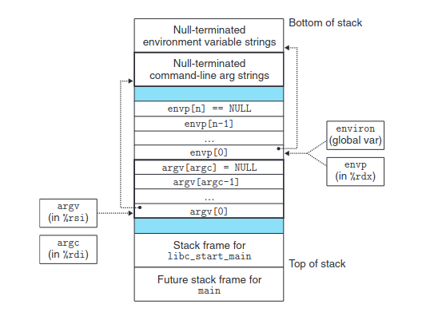

# Hello World, What do you do?

In this installment we want figure out the exact process by which we go from typing the 
command `./hello` to our assembly code executing on the processor. As we saw in 
[dynamic linking](../Dynamic_Linking/), the dynamic linker is executed either prior to our 
programs execution or even during our programs exeutions. Also as we saw in our first 
[hello world](../Hello_World/) exploration, a basic hello world that uses the C standard 
library has several other functions and start up proedures than first meets the eye. Our 
Goal in this installment is to figure what is going on with these start up procedures. 
Specifically we will cover:

* Command Line Arguments and Environment Variables
* Return Codes
* The shell
* Libc and Dynamic Linker Invocation


## Command Line Args and Environment Variables

In `cmd_args.c` we write a small program to output the contents and locations of the 
command line args and evironment variables relative to the main stack frame. Running this 
we can gather a few interesting things that one may not have been aware of prior

* First note the non standard signature: `int main(int argc, char** argv, char** envp)`.
    * Most only use thd first two arguments to main, however environment variables can 
      also be accessed via a 3rd main argument.
    * They can also be accessed via the C standard library global `environ`.
* The environment variables of the shell used to execute the program are loaded into the 
  DB Cheat Sheememory of the program. Specifically the stack.
    * Using proc/<pid>/maps we can see that these are stored at the very very top of the 
      DB Cheat Sheememory region allocated for the stack. 
* The command line args are also stored at the very top of the stack
* This gives us the following stack layout per 
  [CSAPP](../Computer%20Systems%20A%20Programmers%20Perspective%20(3rd).pdf) :



This leads to an important question, **who exactly is responisble for setting up the stack 
with these environment variables and command line args?** We can determine if it is the C 
standard library by writing a C program that is compiled with the `-nostdlib` flag and 
exploring its stack space. We create a C program called `no_lib.c `. Its compiled with 
`gcc -nostdlib -static  -fno-asynchronous-unwind-tables -o no_lib no_lib.c`. Now we use gdb
to explore its stack space.

* `gdb no_lib`
* `b _start`
* `r`
* `info inferiors` to get pid
* Use `cat /proc/<pid>/maps` to see mem segments
    * we can see top of stack is at `0x7ffffffff000`
* `info reg` shows `rsp = 0x7fffffffe000` a full 0x1000 off from allocated stack memory 
  segment.
* If we start examining memory we see we get the exact layout as shown in the image above. 
  Only difference is now our `_start` stack frame is directly beneath the start of the argv
  and envp arrays and strings.

Thus this leads to the question, **who or what exactly is creating this stack memory 
segment and who is copying the env and cmd line arguments onto the stack memory segment?** 
We will explore this later in this installment. But as we've seen command line arguments are 
accessible because they copied by something into our programs stack memory.

## Return Codes

Return or exit codes are concept used to tell whether a program executed successfully or 
not. Its mechanism is pretty simply and is arbitraited by system calls. The `exit` system 
call allows a process to indicate to its parent what its exit code is, and this is returned 
to the parent via the `waitpid` system call. These exit codes are heavily relied on by the 
unix shell. This all will make more sense once we cover processess and if one reads the 
Bash Shell appendix entry. However for now, the key take away is that return codes or exit 
codes are implemented via system calls.

## The Shell and Launching a Program

We are not gonna look at how new processes are created on Linux at this moment. We will 
cover processes in much more detail later. But the creation of a process is going to shed 
light on our current topic, loading programs. All processes are created by "forking" or 
duplicating an existing process. This copies just about everything in the current process 
and duplicates in the second "child" process. Again we will cover this in more detail, but 
that is what fork is at its essence. The Exec family of system calls replaces the current 
process image with that of the new one specified in its arguments. As we will see, it is 
this system call that sets up the stack with the command line args and the environment 
variables.

This fork, exec combo is how the shell launches your program. While the shell does much 
more than this, at the end of the day when you type `./my_prog`, the shell process forks 
and calls exec on your passed program. Since all of this outside of our current scope and 
will be covered in detail later, we shall answer our above question simply and leave it for
later study. That is, who is creating the stack memory and copying command line args to it?
Exec.

## Libc and Dynamic Linker Invocation

We are leaving exploring process creation to our study of process later. Thus we will 
conclude this section by looking at what happens to a hello world, using the C standard 
library, when it is ran. Specifically we will start our study when the memory of the process
is set up and the instruction pointer pointing to the first instruction as specified by the
start point in the ELF header.


The above call graph gives us an idea of what to look for as we reverse engineer our hello 
world:

```C
#include <stdio.h>

int main()
{
    printf("Hello\n");
    return 0;
}
```

### Init

We will dig into the loading of the above program by using GDB. If we start executing at 
the very first instruction we see that we find ourself in the _start function of the 
dynamic linker (ld-linux-x86-64.so.2). Skipping through the execution of the dynamic linker
and looking at the GOT before and after we get the table below. We can see from this that 
dynamic linker chose not to do lazy binding and the required symbols were linked prior to 
the dynamic linker passing control to our exe.

| .got Addr | Symbol | Val before linker | Val after |
| --- | --- | --- | --- |
| 0x555555557fb8 | .dynamic | 0x3dc8 | 0x3dc8 |
| 0x555555557fc0 | dynamic reloc entries | 0x0 | 0x0 |
| 0x555555557fc8 | dynamic linker | 0x0 | 0x0 |
| 0x555555557fd0 | puts | 0x1030 | 0x7ffff7e2f4 |
| 0x555555557fd8 | _ITM_deregisterTMCloneTable | 0x0 | 0x0 |
| 0x555555557fe0 | __libc_start_main | 0x0 | 0x7ffff7dcef90 |
| 0x555555557fe8 | __gmon_start_ | 0x0 | 0x0 |
| 0x555555557ff0 | _ITM_registerTMCloneTable | 0x0 | 0x0 |
| 0x555555557ff8 | __cxa_finalize | 0x0 | 0x7ffff7df1f10 |

Using GDB and objdump we can see that the compiler made our entry point for us. The _start 
function sets up some registers, passes the location of main, __libc_csu_fini, and 
__libc_csu_init to __libc_start_main, which was linked during the invocation of the dynamic
linker at the start of the program. libc_start's source code can be accessed 
[here](https://www.gnu.org/software/libc/sources.html). libc-start is doing a few key things
. These are:

* Setting up pthreads
* Calling early init functions
    * This is actually done by the dynamic linker in the case of a shared object as in our case here
    * The _init symbol is also called by the dynamic linker. It purpose is to execute code when a shared library gets loaded.
    * This _init function is also what calls gmon_start, a symbol for setting up the gmon profiler.
    * This is point at which user group and permissions are checked
* Libc init (if not done so by the dynamic linker)
* Register destructor of statically linked programs (__cxa_atexit)
    * This calls the destructors when the shared library is unloaded.
* Call the init array
    * This is different from the pre init array. This array has access to the loaded libraries and is true constructor of the program
    * This is what __libc_csu_init does.
* Finally call main with the proper arguments as shown in the previous section.

This covers the libc init process fairly well. Looking at our call stack below, we are missing a few key topics:

* Frame Dummy - Called by __libc_csu_init. Used in stack unwinding in exception handling. (Not really covered throughout our project).
* TM Clones - Used in [GNU ITM](https://gcc.gnu.org/onlinedocs/libitm/). Again outside of scope.

### Fini

When main exits, it passes its return code back to __libc_start_main who immediatly calls __GI_exit again passing the return code. This in turn calls run_exit_handlers, for which we have GLIBC C code for (in the file `exit`). This function will:

* Clean up thread local storage
* Calls all functions registered with the atexit function in reverse order
* Calls fini functions in order of array
* Finally call destructors
* Clean up STDIO
* Call exit with correct status code

### Hello Call Stack

Below is the FULL call stack of a hello world, not including the invocation of the dynamic linker. We include this here as a reference and to ensure that we cover the full program startup and procedures implemented by libc.

* _start in our hello
    * __lib_start_main
        * __GI___cxa_atexit
            * __new_exitfn
    * __libc_csu_init
        * _init
            * __gmon_start **NOT CALLED, BUT WOULD BE**
        * frame_dummy
                * register_tm_clones
    * main
    * __GI_exit
        * __run_exit_handlers
            * __GI___call_tls_dtors
            * _dl_fini
                * rtld_lock_default_lock_recursive
                * _dl_sort_maps
                    * memset
                * __do_global_dtors_aux
                    * __cxa_finalize
                        * __unregister_atfork
                    * deregister_tm_clones
            * IO_cleanup
                * _IO_flush_all_lockp

### Questions
* DSO and __dso_handle 
    * Dynamically shared object

### Resources
* https://www.sco.com/developers/gabi/latest/ch5.dynamic.html#init_fini
* http://dbp-consulting.com/tutorials/debugging/linuxProgramStartup.html

### cmd_args.c

```C
// Find and print all the command line args and environment variables relative
// to the Main funcs stack frame.

#include <stdio.h>      // printf
#include <unistd.h>     // read

void* stack_base;

void* rela(void* in)
{
    return (void*)(in - stack_base);
}

int main(int argc, char** argv, char** envp) {

    asm(
        "mov %%rbp, %0;"
        :"=r"(stack_base)
        :
        :
    );

    printf("Main Stack Base = %p\n", stack_base);
    printf("argc = %d\n", argc);
    printf("argv = %p\n",  rela((void*)argv));
    printf("envp = %p\n\n",  rela((void*)envp));

    int i = 0;
    while(argv[i] != NULL)
    {
        printf("argv[%d] = %p    *argv[%d] = %s\n", i,  rela((void*)argv[i]), i, argv[i]);
        ++i;
    }

    printf("\n");
    i = 0;
    while(envp[i] != NULL)
    {
        printf("envp[%d] = %p    *envp[%d] = %s\n", i,  rela((void*)envp[i]), i, envp[i]);
        ++i;
    }

    /*
    int pid = getpid();
    printf("\nPID = %d\n", pid);
    read(0, NULL, 1);
    */


}
```

### no_lib.c

```C
// C program with no std library. Find the top of the stack frame of the start
// function, then use procfs to see how much memory is in between that and the
// end of the stack allocated memory segment.

// Easiest way to do this is a nop start and use gdb

void _start()
{
    asm(
        "nop\n"
        "pop %rbp\n"
        "mov $60, %rax\n"
        "mov $17, %rdi\n"
        "syscall\n"
    );
}

```
